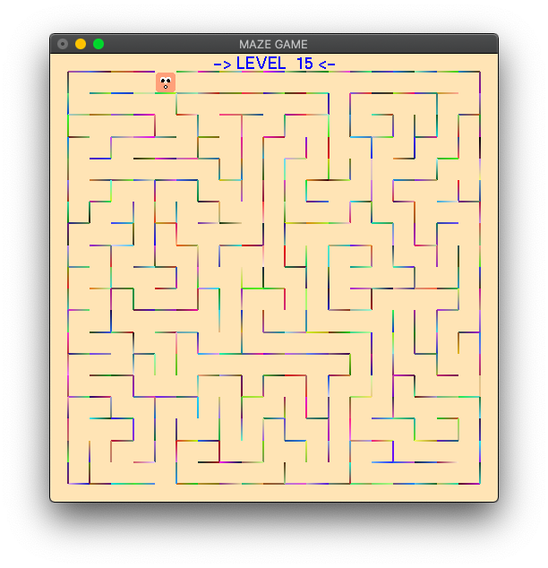
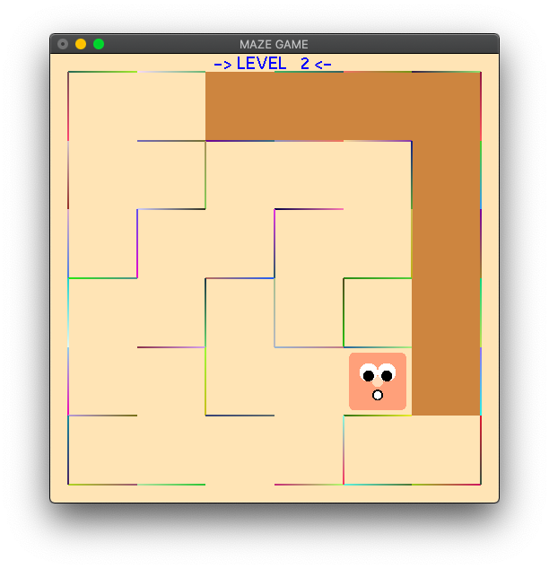

# CG-MazeGame
A Simple Maze Game Using Open GL

# EnvSetup
## Compile Machine Code
- Mac OS (Recommended):
```
> g++ mg.cpp -Wno-deprecated-declarations -framework GLUT -framework OpenGL
> ./a.out
```
- Windows/Linus
```
> g++ mg.cpp -lglut -lGLU -lGL
> ./a.out
```
## Compile WebAssembly
- Mac OS (Recommended):
```
> em++ mg.cpp -o ./docs/index.html -s LEGACY_GL_EMULATION=1 --shell-file ./WebAssembly/Template/index.html
> cd docs
> python -m SimpleHTTPServer 80
```

# **Controls**
- W/w - UP
- S/s - DOWN
- A/a - LEFT
- D/d - RIGHT
- R/r - Reset
- N/n - NewGame
- U/u - Raise Level
- L/l - Lower Level
- '+' - Zoom

# Screenshot




# Web Assembly:
[https://sid-heart.github.io/CG-MazeGame](https://sid-heart.github.io/CG-MazeGame)
